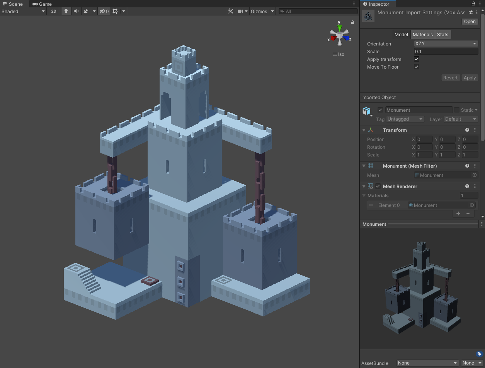

# UnityVoxSupport

---

This package provides direct support for .vox files in Unity.




## Install

---

1. Open package manager
2. Select **+**
3. Add package from git URL
4. Write https://github.com/HelpOrMe/UnityVoxSupport.git


## How it works

---

1. Import .vox file as 3d array of voxels. 
2. Calculate voxels normals.
3. Calculate corner vertices.
4. Link neighbour corner vertices.
   (corner vert **0** connected with **1** vert, vert **1** connected with **2** etc.).
   Implemented as array that contain second linked vertex by first vertex index. 
   If you recursively iterate any vertex of the links array (like `links[links[links[0]]]..`) 
   you can get a connected graph.
5. Calculate cross links, links between different graphs of the same face. 
   All recursive cross links will be fixed in the next step 
6. Calculate faces. Connect all graphs with cross links to get a simple polygon (monotone).
7. Triangulate faces with ear clipping algorithm.


## API

---

### Quick start

```c#

 public void Main()
 {
     var voxMesh = VoxImporter.Import<VoxMesh>("Flower.vox");
     
     var mesh = new Mesh(); 
     voxMesh.Recalculate();
     voxMesh.Write(mesh);
     voxMesh.Clear();
     
     // Use your mesh!
 }
```

### Import

```c#
 public void Main()
 {
     // Import into the raw structure
     var voxRaw = VoxImporter.Import<VoxRaw>("Flower.vox");
     
     // Import into the mesh ready structure
     var voxMesh = VoxImporter.Import<VoxMesh>("Flower.vox");
     
     // Any vox structure can be converted into another vox structure  
     voxMesh = voxRaw.Convert<VoxMesh>();
 }
```


## License

---

MIT